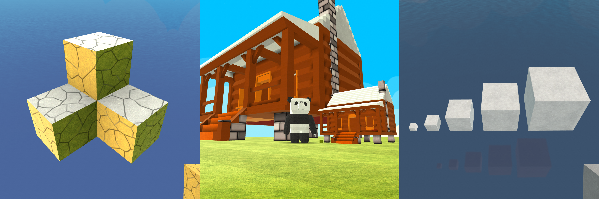

# KogamaTools

A plugin that adds quality of life features to KoGaMa.


# Contents
1. [Introduction](#kogamatools)
2. [Features](#features)
3. [Requirements](#requirements)
4. [Installation](#installation)
5. [Used libraries](#used-libraries)
6. [Help](#need-help)

# **Features**

## 🛠️ **Build Features**

- **Model Tools**:
  - No build limit
  - Custom model scale
  - Single-side painting
  - Copy/paste
  - Export/import
  - Blue mode toggle
  - Destructible materials in model editing
  - Material picking with the mouse wheel
- **Editor**:
  - Free movement in avatar editor
  - Speed modifiers
  - Rotation step size modifier
  - Grid size modifier
  - Unlimited config values (input fields, sliders)
  - Multi-selection
  - Object grouping & Group editor
  - Force object links (e.g., connections to doors, hovercrafts, jetpacks)
  - Force interaction flags (e.g., rotation in all axes, force cloning)

---

## 🎮 **PvP Features**

- Instant respawn
- Anti-AFK
- Camera focus (scoping)
- Custom FOV
- Keybind modifiers
- Camera distance modifier
- Custom crosshair:
  - Color
  - Texture

---

## 🎨 **Graphics Features**

- UI toggle
- Reflective water toggle
- Resolution modifier
- Window mode settings (fullscreen, borderless, etc.)
- Shadow distance
- Draw distance
- Camera distance modifier
- Ortographic camera
- Theme toggle
- Theme preview creator
- Screenshot functionality

---

## 📊 **Info Menu**

- World object counter
- Logic object counter
- Link counter
- Object link counter
- Model counters
- Ping (latency) display
- FPS display

---
## 🌀 **Other**
- Anti ban
- Cheat engine support
- Older versions support (though it might not work 100%)

---

# **Requirements**

- [KoGaMa Standalone Client](https://www-gamelauncher.kogstatic.com/www/KogamaLauncher.msi)  
- [BepInEx 6.0.0-be](https://builds.bepinex.dev/projects/bepinex_be)  
- [.NET 6.0 Runtime](https://dotnet.microsoft.com/pt-br/download/dotnet/6.0)  

---

# **Installation**

## 🚀 **Easy Method (Installer)**
  - Download the latest release of the mod installer [here](https://github.com/Beckowl/KogamaModInstaller/releases/latest)
  - Download the latest release of KogamaTools [here](https://github.com/Beckowl/KogamaTools/releases/latest)
  - Open the installer, click on the "Browse" button next to the ``Mod Path`` field.
  - Locate ``KogamaTools.zip`` and select it. <mark>You do not need to extract the zip file.</mark>
  - Select the game server of your choice and click ``install``.
  - Join any game via the standalone on the selected server. <mark>The game may take between 30 seconds and 2 minutes to open when installing for the first time. Don’t panic if it seems to be stuck.</mark>
  - The KogamaTools GUI should appear after the loading screen.

## 

---

## 🛠️ **Manual Installation**

1. **Locate Your Installation Folder**  
   Depending on the server you play on, navigate to the corresponding folder:
   - **KoGaMa-WWW**:  
     ```
     %localappdata%/KogamaLauncher-WWW\Launcher\Standalone
     ```
   - **KoGaMa-BR**:  
     ```
     %localappdata%/KogamaLauncher-BR\Launcher\Standalone
     ```
   - **KoGaMa-Friends**:  
     ```
     %localappdata%/KogamaLauncher-Friends\Launcher\Standalone
     ```

2. **Install BepInEx**  
   - Download the BepInEx ZIP file.  
   - Extract the contents into the folder you located in Step 1.
   - Run `Kogama.exe`.  
   - If a console window appears, BepInEx has been successfully installed.
   - Wait for the interop assemblies to be generated.

4. **Install KogamaTools**  
   - Download the latest version of [KogamaTools](https://github.com/pipocalio/KogamaTools).  
   - Extract the contents of the ZIP file into the `Plugins` folder created by BepInEx.  

5. **Start KoGaMa**  
   - Join any project or game.  
   - The KogamaTools overlay should appear after the loading screen.

---

## **Used libraries**
- [BepInEx](https://github.com/BepInEx/BepInEx) - *Licensed under the [LGPL-2.1 license](https://opensource.org/licenses/LGPL-2.1)*
- [ClickableTransparentOverlay](https://github.com/zaafar/ClickableTransparentOverlay) - *Licensed under the [Apache-2.0 License](https://opensource.org/licenses/Apache-2.0)*
- [ImGui](https://github.com/ocornut/imgui) - *Licensed under the [MIT license](https://opensource.org/licenses/MIT)*
- [NativeFileDialogSharp](https://github.com/milleniumbug/NativeFileDialogSharp) - *Licensed under the [Zlib license](https://opensource.org/licenses/Zlib)*
- [ParsingHelper](https://github.com/SoftCircuits/ParsingHelper) - *Licensed under the [MIT license](https://opensource.org/licenses/MIT)*

### **Need Help?**  
Join our [Discord Server](https://discord.gg/aP2JYAzZg8) for support & discussions.

